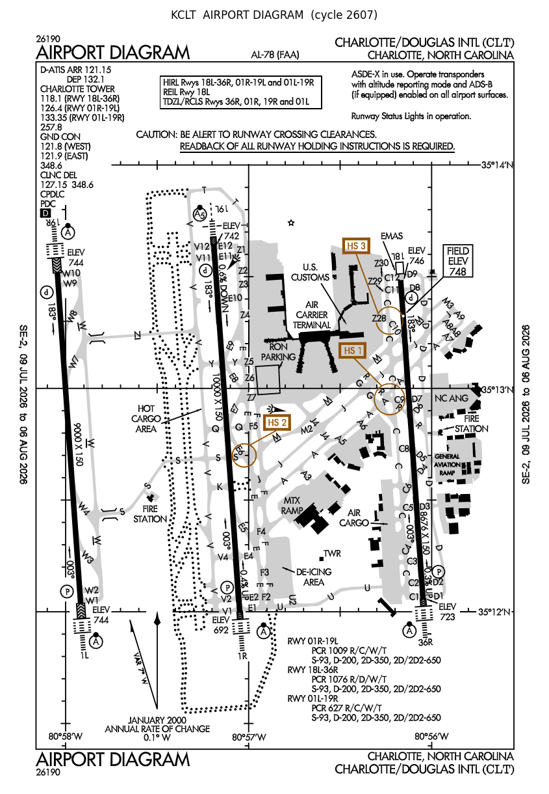

# charts3dprint

**Turn aviation charts into multicolor 3D prints.** Point it at an FAA airport
diagram / approach plate / SID / STAR (or upload any vector PDF, e.g. Jeppesen),
edit the colors, and get a printable **STL / 3MF** — pre-colored for a multi-material
printer (Bambu AMS, etc.).

Aviation charts are *vector* PDFs, so the linework extrudes crisply instead of
looking like a muddy heightmap. Colors come straight from the PDF; you remap them
to the filaments you actually have.



## Quick start (no experience needed)

1. Install **Python 3.9+** from [python.org](https://www.python.org/downloads/).
   On Windows, tick **"Add Python to PATH"** in the installer.
2. Download this project: green **Code ▸ Download ZIP** button above, then unzip.
   (Or `git clone https://github.com/yanjz124/charts3dprint`.)
3. **Double-click the launcher** in the folder:
   - **Windows:** `run.bat`
   - **macOS:** `run.command`  (first time: right-click ▸ Open to allow it)
   - **Linux:** `./run.command`

That's it — it installs what it needs (first run only) and opens the app in your
browser at **http://127.0.0.1:5000**. Search a chart (or upload a PDF), pick your
colors and printer, and download the STL or 3MF.

## Manual install (developers)

```bash
git clone https://github.com/yanjz124/charts3dprint
cd charts3dprint
pip install -r requirements.txt      # or: pip install .
python -m charts3dprint --gui            # GUI  (also: --help for everything)
```

## Use

> Examples use `python -m charts3dprint` (always works). If you ran `pip install .`
> and your Python Scripts folder is on PATH, the shorter `charts3dprint` also works.

### Web GUI (easiest — see the colors)
```bash
python -m charts3dprint --gui       # opens http://127.0.0.1:5000
```
Search a chart **or upload a PDF**, then pick each filament color with a **live
preview** (same color merges; drag to reorder; □ = same level; × = drop to
background), choose your **printer / bed / nozzle** and style, and download the
STL or the pre-colored 3MF.

### Interactive wizard (terminal)
```bash
python -m charts3dprint             # guided: cycle -> airport -> chart type -> chart -> options
```

### One-liners
```bash
# Airport diagram, filling a 256 mm bed, pre-colored 3MF (min filament swaps):
python -m charts3dprint KATL --fit-bed --min-swaps -o out

# Next d-TPP cycle:
python -m charts3dprint KCLT --fit-bed --min-swaps --cycle 2607 -o out

# An approach plate, quantized to gray+black (grayscale chart):
python -m charts3dprint ILM --chart IAP --proc "ILS Z RWY 06" --layered --palette "gray,black" -o out

# Any local PDF (Jeppesen, etc.):
python -m charts3dprint --pdf mychart.pdf --fit-bed --min-swaps --palette "gray,black" -o out

# List all charts for an airport:
python -m charts3dprint KATL --list
```

## Printers

`--fit-bed` scales the chart to fill your bed. Set your machine with `--bed` (mm)
and `--nozzle` (mm), or pick a preset in the GUI. Both matter:

- **Bed size** sets the maximum print size.
- **Nozzle** sets the finest detail: a **0.2 mm** nozzle resolves nearly everything
  (fine text, hatching); a **0.4 mm** nozzle loses the smallest labels. The tool
  reports what % of detail survives your nozzle.
- **Multi-material (AMS/MMU)** lets you print the pre-colored 3MF directly; a
  single-extruder printer can still print the combined **STL** in one color.

## Colors & style

- **Colors are the PDF's own.** In the GUI you remap each to a filament; on the CLI
  use `--palette "gray,black"` to snap everything to the filaments you have
  (near-identical tones merge). `--order` sets the stack (bottom→top; `=` = same level).
- **Style:**
  - `--min-swaps` — colors stacked by height, ~2–3 filament changes total. Best for
    the colored **airport diagrams**.
  - `--layered` — each color is a solid full-height column (marks stay truly black).
    Best for grayscale **approach / SID / STAR** charts.
  - flat — single relief height.

## How it works

PyMuPDF reads the vector paths + colors → shapely unions/offsets them (min line
width, letter-counter holes, white carve-outs) → manifold3d extrudes each color to
a watertight solid → exported as per-color STL + a pre-colored Bambu 3MF. A raster
"completeness" pass recovers any embedded-font text the vectors miss.

## Data & license

FAA charts are public-domain, fetched from the official d-TPP at
`aeronav.faa.gov`. MIT licensed. Not for navigation — decorative/reference use only.
